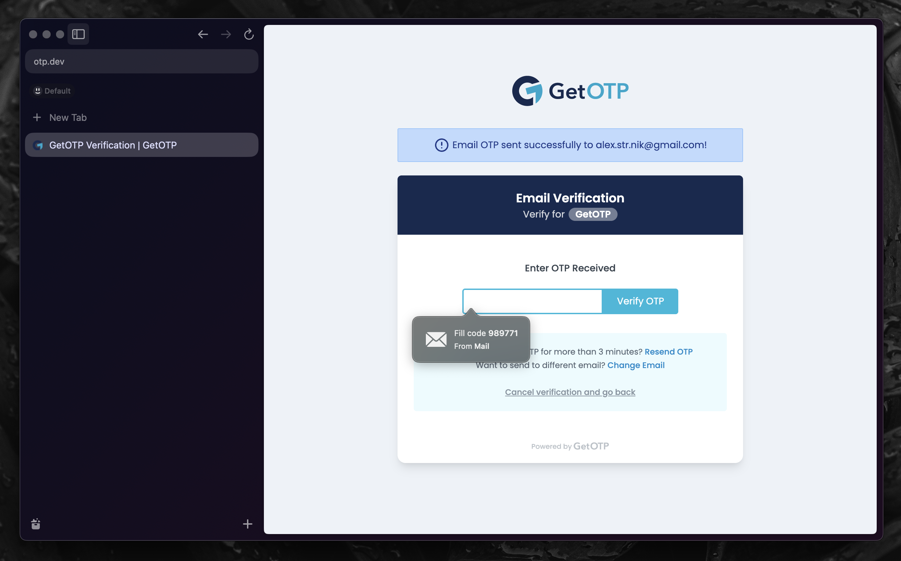

# SafariPark



**SafariPark** brings Safari’s **OTP autofill** feature to any macOS app, making email and phone confirmation codes seamless outside of Safari.

## Security Warning

SafariPark relies on **private entitlements and frameworks** from Safari, which are not publicly documented or officially supported. To run it, you’ll need to **disable SIP and AMFI**, which **significantly reduces your Mac’s security**. Proceed at your own risk.

## Disabling SIP & AMFI (Not Recommended)

If you still want to try it, follow these steps:

1. **Boot into recovery mode**: Hold **Command (⌘) + R** while starting your Mac.
2. **Open Terminal** and run:

   ```sh
   csrutil disable  # Disables SIP
   nvram boot-args="amfi_get_out_of_my_way=0x1"  # Disables AMFI
   ```

3. **Reboot your Mac**.

### Disclaimer

Disabling **SIP (System Integrity Protection)** and **AMFI (Apple Mobile File Integrity)** makes your Mac **vulnerable to malware and unauthorized system modifications**. Only do this if you understand the risks and have a reason to test private APIs.

Use **at your own risk**—this is for educational purposes only.

## Installation

Copy SafariPark.app to /Library/Input Methods.
Run it from there.
If it doesn’t work immediately, log out and log back in.
If the app starts successfully, you should see a status bar item confirming it's running.
